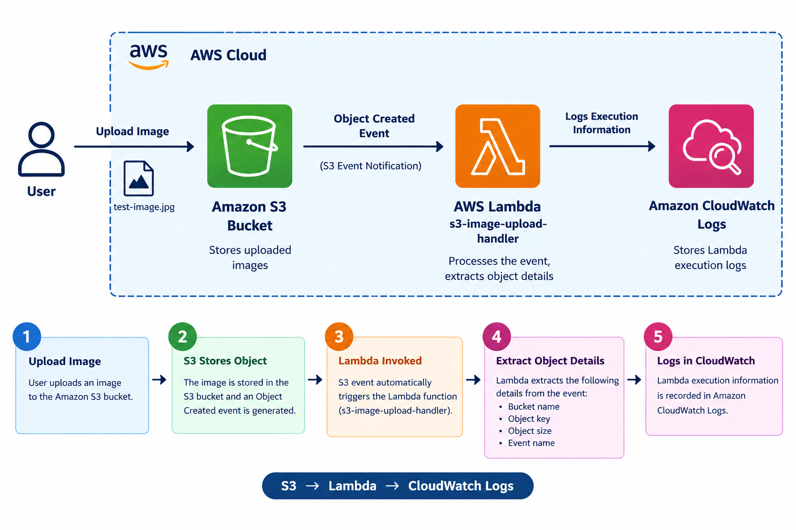
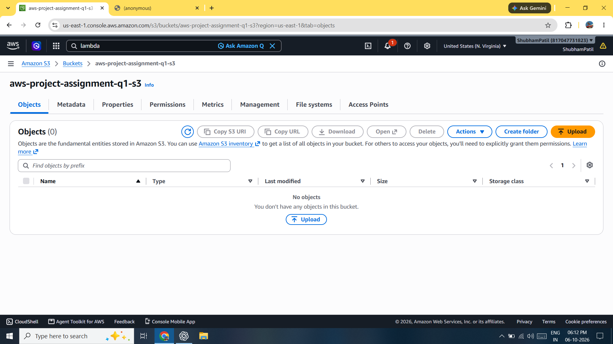
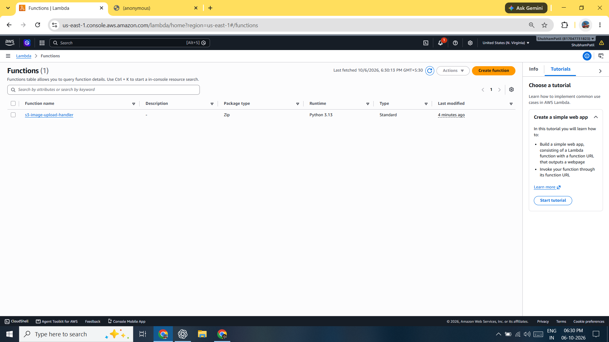
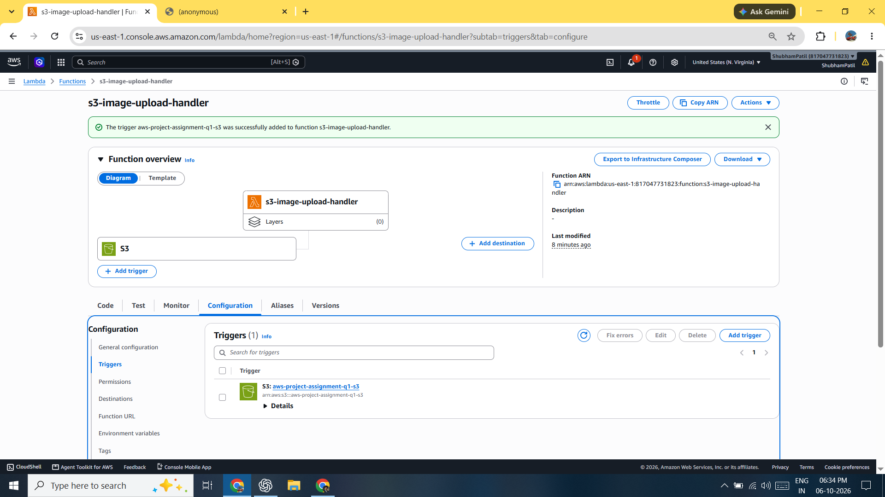
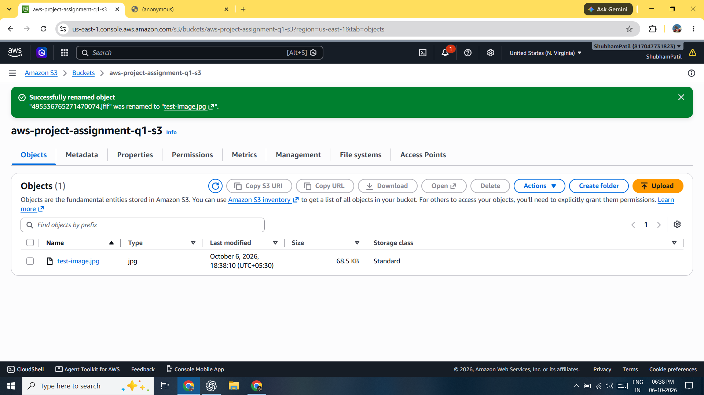
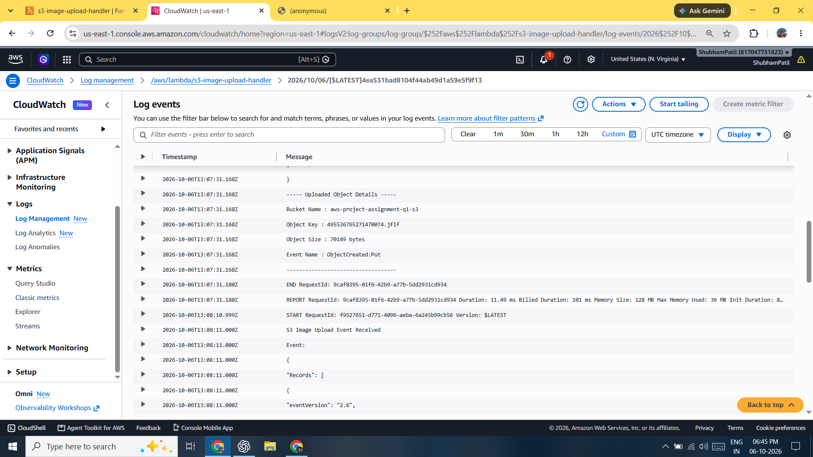

# Question 1 — Serverless Image Upload Workflow using Amazon S3 and AWS Lambda

## 📌 Project Overview

This project implements a serverless image-upload workflow using **Amazon S3** and **AWS Lambda**.

When an image is uploaded to an Amazon S3 bucket, an **S3 Object Created event** automatically invokes an AWS Lambda function. The Lambda function extracts details of the uploaded object and records the execution information in **Amazon CloudWatch Logs**.

---

## 🎯 Objective

The objective of this project is to:

- Upload an image to Amazon S3.
- Automatically trigger AWS Lambda through an S3 event.
- Extract details of the uploaded S3 object.
- Record Lambda execution information in Amazon CloudWatch Logs.
- Verify the complete serverless workflow through testing.

---

## ☁️ AWS Services Used

| AWS Service | Purpose |
|---|---|
| **Amazon S3** | Stores uploaded images |
| **AWS Lambda** | Processes the S3 upload event |
| **Amazon CloudWatch Logs** | Stores Lambda execution logs |

---

## 🏗️ Architecture



### Workflow

```text
User
  │
  │ Upload Image
  ▼
Amazon S3 Bucket
  │
  │ Object Created Event
  ▼
AWS Lambda
  │
  │ Extract Object Details
  ▼
Amazon CloudWatch Logs
```

### Architecture Explanation

1. The user uploads an image to the Amazon S3 bucket.
2. Amazon S3 detects the object creation event.
3. S3 automatically invokes the configured AWS Lambda function.
4. Lambda receives the S3 event information.
5. Lambda extracts details such as:
   - Bucket name
   - Object key
   - Object size
   - Event name
6. Lambda records the execution and extracted information in Amazon CloudWatch Logs.

---

# 🔧 Implementation

## Step 1 — Create S3 Bucket

An Amazon S3 bucket was created to store the uploaded image.

### Configuration

- **Bucket Name:** `<YOUR-BUCKET-NAME>`
- **Region:** `<YOUR-REGION>`
- **Object Ownership:** Bucket owner enforced
- **Public Access:** Block all public access
- **Encryption:** SSE-S3

### Screenshot



---

## Step 2 — Create AWS Lambda Function

A Lambda function was created to process the S3 Object Created event.

### Configuration

- **Function Name:** `s3-image-upload-handler`
- **Runtime:** Python 3.13
- **Architecture:** x86_64

### Lambda Function

```python
import json
import urllib.parse


def lambda_handler(event, context):

    print("S3 Image Upload Event Received")
    print("Event:")
    print(json.dumps(event, indent=2))

    for record in event.get("Records", []):

        bucket_name = record["s3"]["bucket"]["name"]

        object_key = urllib.parse.unquote_plus(
            record["s3"]["object"]["key"]
        )

        object_size = record["s3"]["object"].get("size", "Unknown")

        event_name = record["eventName"]

        print("----- Uploaded Object Details -----")
        print(f"Bucket Name : {bucket_name}")
        print(f"Object Key  : {object_key}")
        print(f"Object Size : {object_size} bytes")
        print(f"Event Name  : {event_name}")
        print("-----------------------------------")

    return {
        "statusCode": 200,
        "body": json.dumps("S3 image upload processed successfully")
    }
```

### Screenshot



---

## Step 3 — Configure S3 Event Trigger

The S3 bucket was configured to invoke the Lambda function when an object is created.

### Trigger Configuration

- **Source:** Amazon S3
- **Event Type:** All object create events
- **Target:** `s3-image-upload-handler`
- **Prefix:** None
- **Suffix:** None

### Screenshot



---

## Step 4 — Upload Image

A test image was uploaded to the S3 bucket.

### Test File

```text
test-image.jpg
```

### Screenshot



---

## Step 5 — Lambda Execution

After the image was uploaded, the S3 Object Created event automatically invoked the Lambda function.

The Lambda function processed the event and extracted the uploaded object's details.

---

## Step 6 — CloudWatch Logs

Lambda execution information was recorded in Amazon CloudWatch Logs.

The logs contain information such as:

```text
S3 Image Upload Event Received

----- Uploaded Object Details -----
Bucket Name : <BUCKET-NAME>
Object Key  : test-image.jpg
Object Size : <SIZE> bytes
Event Name  : ObjectCreated:Put
-----------------------------------
```

### Screenshot



---

# ⚙️ Configuration Details

Detailed configuration information is available in:

[`configuration/configuration-details.md`](configuration/configuration-details.md)

---

# 🧪 Testing

## Test Case 1 — Image Upload

**Objective:**  
Verify that an image can be successfully uploaded to the S3 bucket.

**Expected Result:**  
The image should appear in the S3 bucket.

**Result:**  
PASS

---

## Test Case 2 — S3 Event Trigger

**Objective:**  
Verify that uploading an image automatically invokes Lambda.

**Expected Result:**  
The S3 Object Created event should trigger the Lambda function.

**Result:**  
PASS

---

## Test Case 3 — Object Details Extraction

**Objective:**  
Verify that Lambda extracts the uploaded object's information.

**Expected Result:**  
Lambda should extract:

- Bucket name
- Object key
- Object size
- Event name

**Result:**  
PASS

---

## Test Case 4 — CloudWatch Logging

**Objective:**  
Verify that Lambda execution information is recorded in CloudWatch Logs.

**Expected Result:**  
The Lambda execution logs should be available in CloudWatch.

**Result:**  
PASS

Detailed testing information is available in:

[`testing/testing-results.md`](testing/testing-results.md)

---
