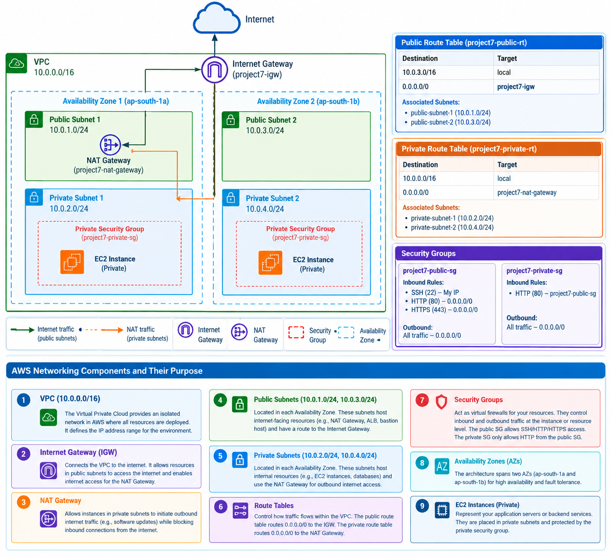
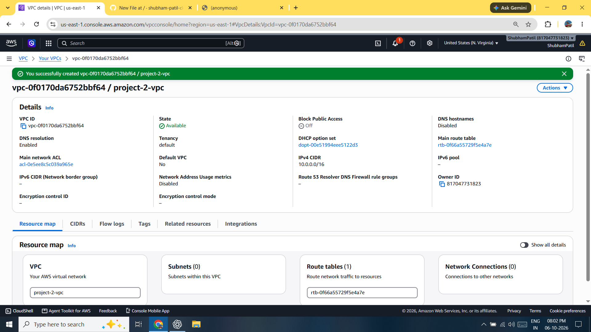
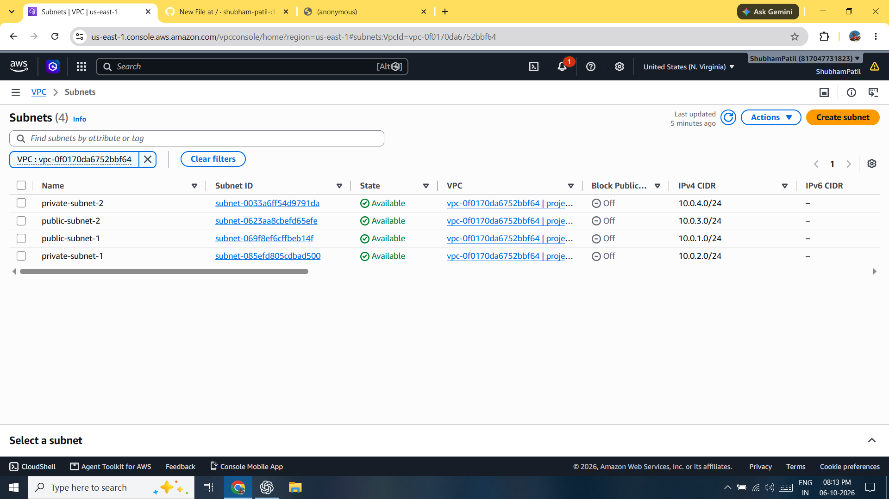
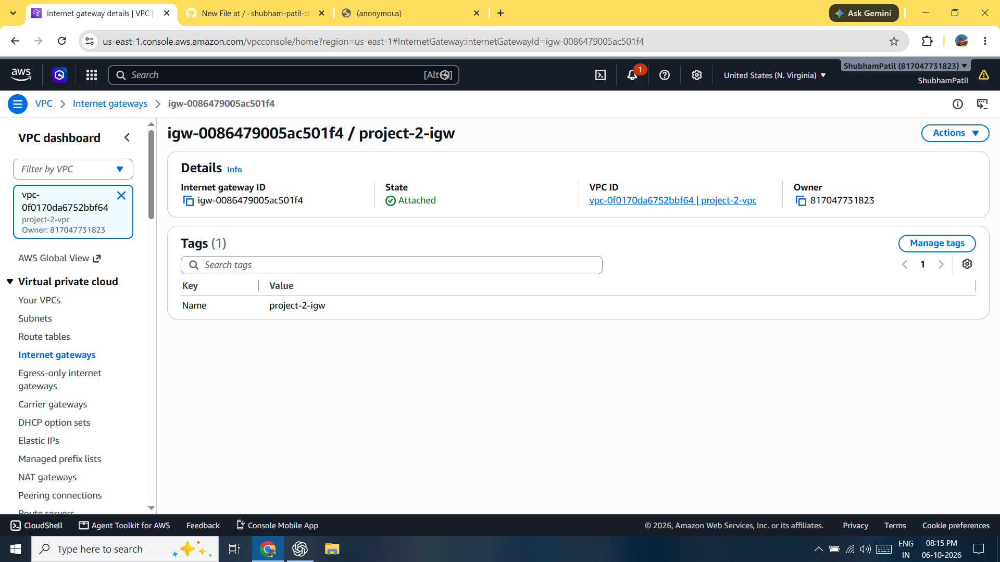
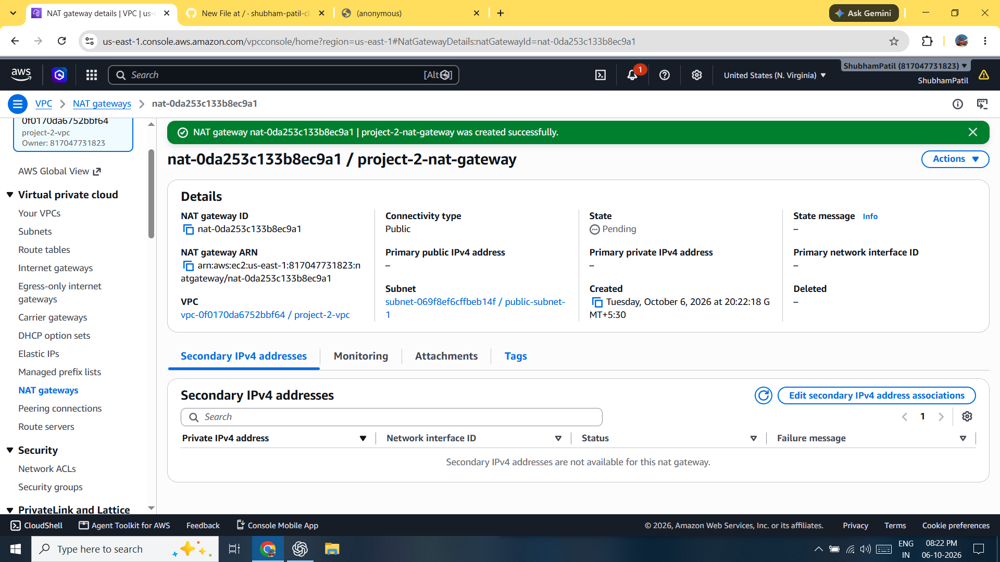
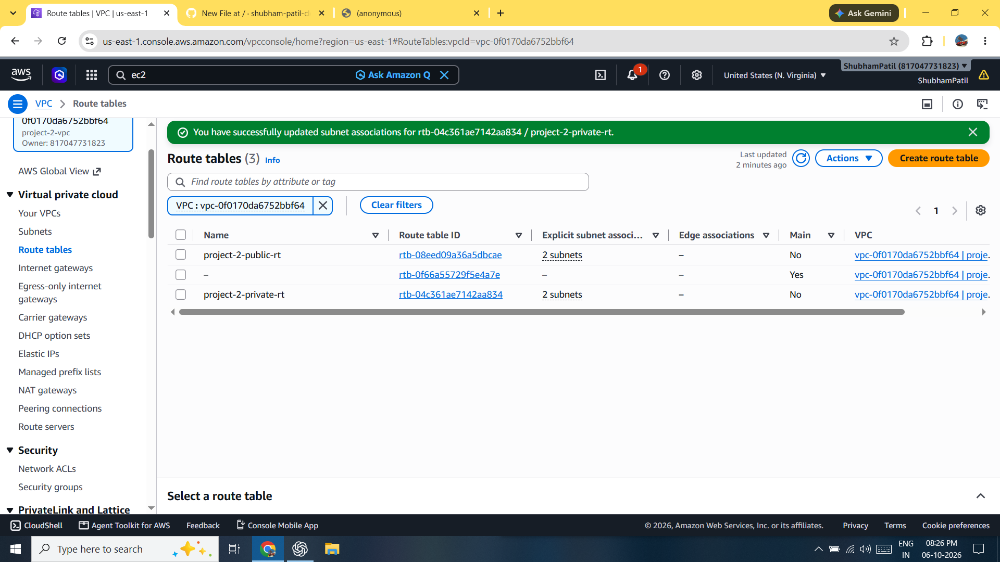
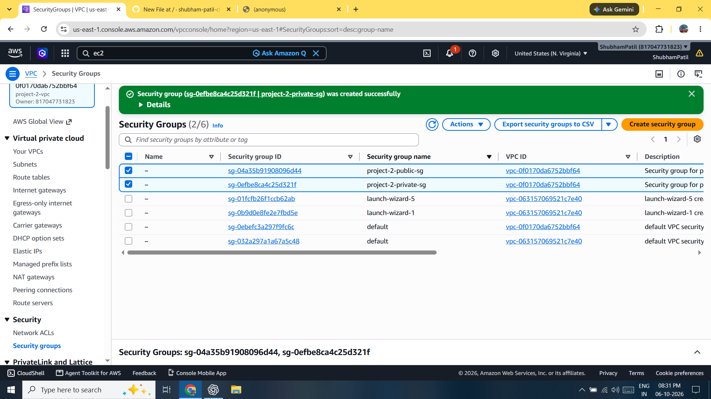
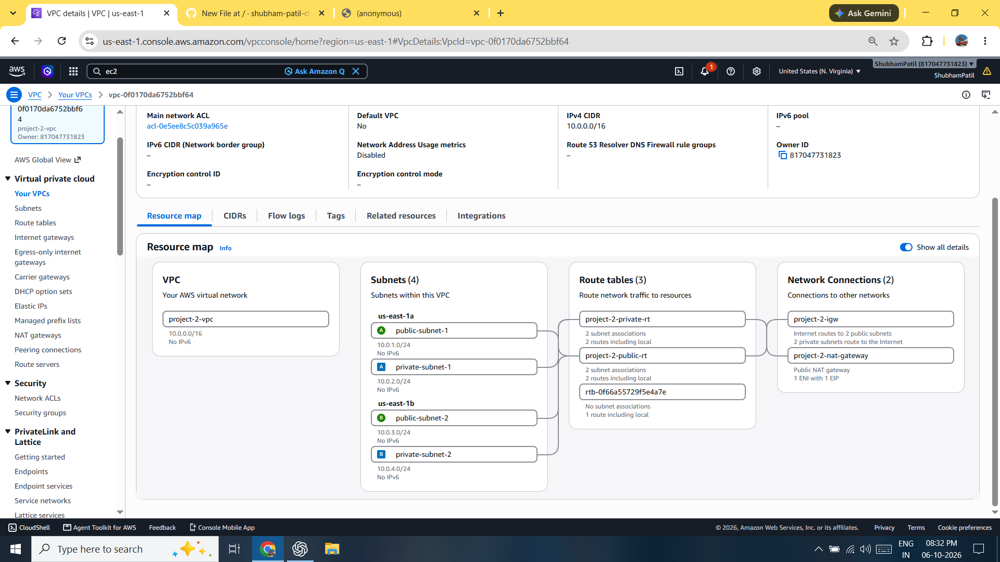
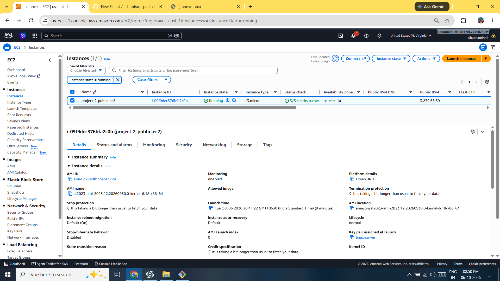
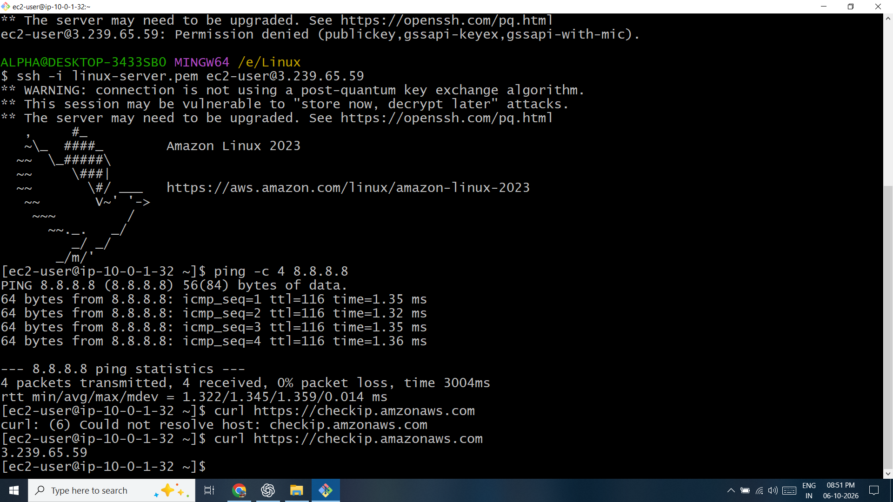

# Question 2 — AWS VPC Network Architecture

## 📌 Project Overview

This project implements a complete AWS network architecture using a custom VPC with two Availability Zones, public and private subnets, an Internet Gateway, NAT Gateway, Route Tables, and Security Groups.

An EC2 instance was also deployed to test and validate the network configuration.

---

## 🎯 Objective

The objective is to design and implement a VPC network architecture containing:

- Custom VPC
- Two Availability Zones
- Public subnets
- Private subnets
- Internet Gateway
- NAT Gateway
- Route Tables
- Security Groups
- EC2 network testing
- Architecture documentation

---

## ☁️ AWS Services Used

| AWS Service | Purpose |
|---|---|
| Amazon VPC | Provides the isolated virtual network |
| Availability Zones | Provides infrastructure separation |
| Amazon EC2 | Used for network testing |
| Internet Gateway | Provides internet connectivity for public resources |
| NAT Gateway | Provides outbound internet access for private resources |
| Route Tables | Control network traffic routing |
| Security Groups | Control inbound and outbound traffic |

---

# 🏗️ Architecture



### VPC

**Name:** `project-2-vpc`

**CIDR:** `10.0.0.0/16`

The VPC contains four subnets distributed across two Availability Zones.

### Availability Zone 1 — `ap-south-1a`

| Subnet | CIDR | Type |
|---|---|---|
| `public-subnet-1` | `10.0.1.0/24` | Public |
| `private-subnet-1` | `10.0.2.0/24` | Private |

### Availability Zone 2 — `ap-south-1b`

| Subnet | CIDR | Type |
|---|---|---|
| `public-subnet-2` | `10.0.3.0/24` | Public |
| `private-subnet-2` | `10.0.4.0/24` | Private |

---

# 🔧 Network Components

## 1. VPC

**Name:** `project-2-vpc`

**CIDR:** `10.0.0.0/16`

The VPC provides an isolated virtual network for the resources used in this project.

---

## 2. Availability Zones

Two Availability Zones are used:

- `ap-south-1a`
- `ap-south-1b`

The subnets are distributed across both Availability Zones to provide infrastructure separation.

---

## 3. Public Subnets

Two public subnets were created:

- `public-subnet-1` — `10.0.1.0/24`
- `public-subnet-2` — `10.0.3.0/24`

The public subnets use a route table containing a default route to the Internet Gateway.

---

## 4. Private Subnets

Two private subnets were created:

- `private-subnet-1` — `10.0.2.0/24`
- `private-subnet-2` — `10.0.4.0/24`

The private subnets do not have a direct route to the Internet Gateway.

Outbound internet traffic is routed through the NAT Gateway.

---

# 🌐 Internet Gateway

**Name:** `project-2-igw`

The Internet Gateway provides a path between the VPC and the internet for resources in appropriately configured public subnets.

### Public Route

```text
0.0.0.0/0 → project-2-igw
```

### Traffic Flow

```text
Internet
   ↓
Internet Gateway
   ↓
Public Route Table
   ↓
Public Subnet
   ↓
EC2
```

---

# 🔀 NAT Gateway

**Name:** `project-2-nat-gateway`

**Subnet:** `public-subnet-1`

**Connectivity Type:** Public

The NAT Gateway provides outbound internet connectivity for resources in private subnets.

### Private Traffic Flow

```text
Private Subnet
      ↓
Private Route Table
      ↓
NAT Gateway
      ↓
Internet Gateway
      ↓
Internet
```

Private resources therefore do not require a direct route to the Internet Gateway.

---

# 🛣️ Route Tables

## Public Route Table

**Name:** `project-2-public-rt`

### Routes

| Destination | Target |
|---|---|
| `10.0.0.0/16` | local |
| `0.0.0.0/0` | `project-2-igw` |

### Associated Subnets

- `public-subnet-1`
- `public-subnet-2`

---

## Private Route Table

**Name:** `project-2-private-rt`

### Routes

| Destination | Target |
|---|---|
| `10.0.0.0/16` | local |
| `0.0.0.0/0` | `project-2-nat-gateway` |

### Associated Subnets

- `private-subnet-1`
- `private-subnet-2`

---

# 🔐 Security Groups

## Public Security Group

**Name:** `project-2-public-sg`

### Inbound Rules

| Type | Port | Source |
|---|---:|---|
| SSH | 22 | My IP |
| HTTP | 80 | `0.0.0.0/0` |
| HTTPS | 443 | `0.0.0.0/0` |

### Outbound

```text
All traffic → 0.0.0.0/0
```

---

## Private Security Group

**Name:** `project-2-private-sg`

### Inbound Rules

| Type | Port | Source |
|---|---:|---|
| HTTP | 80 | `project-2-public-sg` |

### Outbound

```text
All traffic → 0.0.0.0/0
```

Security Groups control traffic to resources associated with them.

---

# 🖥️ EC2 Network Testing

A public EC2 instance was created to validate the network configuration.

| Setting | Value |
|---|---|
| Instance Name | `project-2-public-ec2` |
| VPC | `project-2-vpc` |
| Subnet | `public-subnet-1` |
| Public IP | Enabled |
| Security Group | `project-2-public-sg` |

The instance was accessed using SSH and internet connectivity was tested.

### Test Traffic Flow

```text
EC2
 ↓
Public Subnet
 ↓
Public Route Table
 ↓
Internet Gateway
 ↓
Internet
```

The public EC2 instance successfully accessed the internet.

---

# 🧪 Testing Results

| Test | Result |
|---|---|
| VPC configuration | ✅ PASS |
| Two Availability Zones | ✅ PASS |
| Public subnets | ✅ PASS |
| Private subnets | ✅ PASS |
| Internet Gateway | ✅ PASS |
| NAT Gateway | ✅ PASS |
| Public route table | ✅ PASS |
| Private route table | ✅ PASS |
| Security Groups | ✅ PASS |
| EC2 internet connectivity | ✅ PASS |

---

# 📸 Screenshots

## 1. VPC Configuration



## 2. Subnets



## 3. Internet Gateway



## 4. NAT Gateway



## 5. Route Tables



## 6. Security Groups



## 7. Final Verification



## 8. Public EC2



## 9. EC2 Network Test



---

