# Question 3 — EC2 + Application Load Balancer + Auto Scaling

## 📌 Project Overview

This project demonstrates a highly available web application deployed on AWS using **Amazon EC2, Application Load Balancer (ALB), and Auto Scaling** across multiple Availability Zones.

The application is accessed through the ALB DNS name. The Auto Scaling Group maintains the required number of EC2 instances and automatically replaces an instance when it fails.

---

## 🎯 Objective

- Deploy a web application using Amazon EC2.
- Distribute incoming traffic using an Application Load Balancer.
- Deploy EC2 instances across multiple Availability Zones.
- Configure an Auto Scaling Group.
- Configure health checks and scaling.
- Access the application through the ALB DNS name.
- Test application availability when an EC2 instance fails.
- Verify automatic replacement of the failed instance.

---

## ☁️ AWS Services Used

- **Amazon VPC** — Network environment
- **Amazon EC2** — Web servers
- **Application Load Balancer** — Traffic distribution
- **Auto Scaling** — Instance management and automatic replacement
- **Target Group** — EC2 target registration and health checks
- **Security Groups** — Network access control
- **Internet Gateway** — Internet connectivity

---

## 🏗️ Architecture

The application is deployed across two Availability Zones.

```text
                         Internet
                            │
                            ▼
                  ┌──────────────────┐
                  │ Application      │
                  │ Load Balancer    │
                  │   project3-alb   │
                  └────────┬─────────┘
                           │
              ┌────────────┴────────────┐
              │                         │
              ▼                         ▼
        Availability Zone A       Availability Zone B
        ap-south-1a               ap-south-1b
        ┌──────────────┐          ┌──────────────┐
        │ EC2 Instance │          │ EC2 Instance │
        │ Web Server 1 │          │ Web Server 2 │
        └──────────────┘          └──────────────┘
              ▲                         ▲
              └────────────┬────────────┘
                           │
                   Auto Scaling Group
                           │
                 Health Check + Scaling
```

### Architecture Diagram

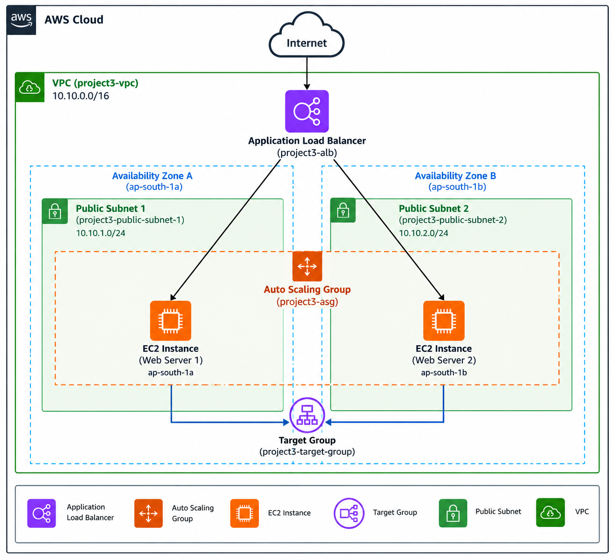

---

## 🔧 AWS Configuration

### VPC

| Configuration | Value |
|---|---|
| VPC Name | `project3-vpc` |
| CIDR | `10.10.0.0/16` |

### Public Subnets

| Subnet | Availability Zone | CIDR |
|---|---|---|
| `project3-public-subnet-1` | `ap-south-1a` | `10.10.1.0/24` |
| `project3-public-subnet-2` | `ap-south-1b` | `10.10.2.0/24` |

### Security Group

**Security Group:** `project3-web-sg`

| Type | Port | Source |
|---|---:|---|
| HTTP | 80 | `0.0.0.0/0` |
| SSH | 22 | My IP |

Outbound traffic is allowed.

---

## 🖥️ Launch Template

**Launch Template:** `project3-launch-template`

Configuration:

| Setting | Value |
|---|---|
| AMI | Amazon Linux |
| Instance Type | `t3.micro` |
| Security Group | `project3-web-sg` |
| Public IPv4 | Enabled |

The Launch Template contains User Data that:

1. Updates the instance.
2. Installs Apache HTTP Server.
3. Enables Apache at boot.
4. Starts Apache.
5. Creates the Project 3 web application page.

---

## 🎯 Target Group

**Target Group:** `project3-target-group`

| Configuration | Value |
|---|---|
| Target Type | Instances |
| Protocol | HTTP |
| Port | 80 |
| VPC | `project3-vpc` |
| Health Check Protocol | HTTP |
| Health Check Path | `/` |
| Success Code | `200` |

The Auto Scaling Group automatically registers its EC2 instances with the target group.

---

## ⚖️ Application Load Balancer

**Load Balancer:** `project3-alb`

| Configuration | Value |
|---|---|
| Type | Application Load Balancer |
| Scheme | Internet-facing |
| IP Address Type | IPv4 |
| Protocol | HTTP |
| Port | 80 |
| VPC | `project3-vpc` |
| Subnets | Two Availability Zones |
| Target Group | `project3-target-group` |

The ALB distributes incoming HTTP requests to healthy EC2 instances.

---

## 📈 Auto Scaling Group

**Auto Scaling Group:** `project3-asg`

| Configuration | Value |
|---|---:|
| Minimum Capacity | 2 |
| Desired Capacity | 2 |
| Maximum Capacity | 4 |
| Availability Zones | `ap-south-1a`, `ap-south-1b` |
| Health Check | EC2 + ELB |
| Health Check Grace Period | 60 seconds |
| Scaling Policy | Target Tracking |
| Scaling Metric | Average CPU Utilization |
| Target Value | 50% |

The Auto Scaling Group maintains the desired capacity and automatically launches replacement instances when an instance becomes unavailable.

---

# 🧪 Testing

## 1. Target Health Verification

After the Auto Scaling Group launched the instances, the target group showed:

```text
Registered Targets: 2
Healthy: 2
Unhealthy: 0
```

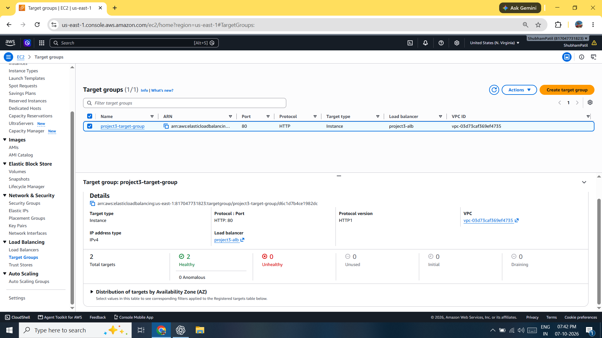

---

## 2. Web Application Test

The application was accessed using the **Application Load Balancer DNS name**.

The web application displayed:

```text
Project 3 Web Application

EC2 + Application Load Balancer + Auto Scaling

Application Status: Running

High Availability: Enabled
```


---

## 3. EC2 Instance Failure Test

One EC2 instance managed by the Auto Scaling Group was terminated intentionally to test high availability.

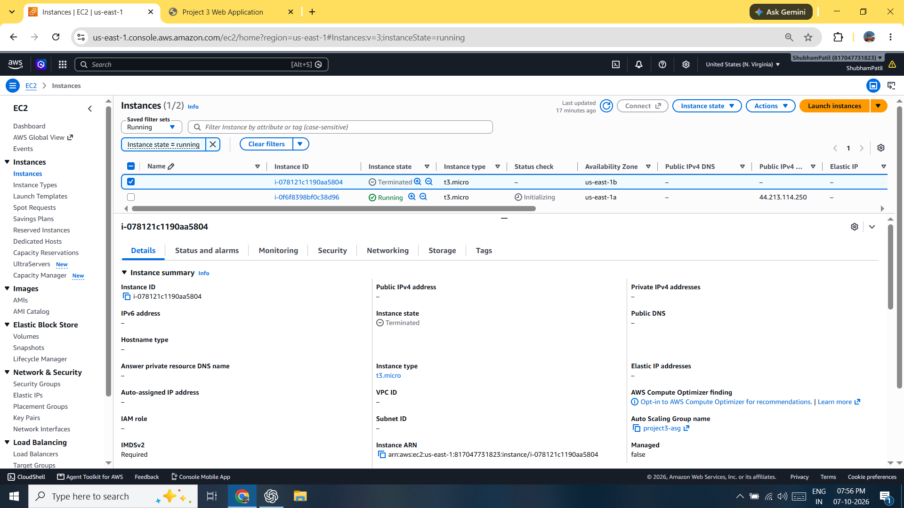

---

## 4. Automatic Instance Replacement

After the instance failure, the Auto Scaling Group detected that the number of running instances had fallen below the desired capacity.

A replacement EC2 instance was automatically launched.

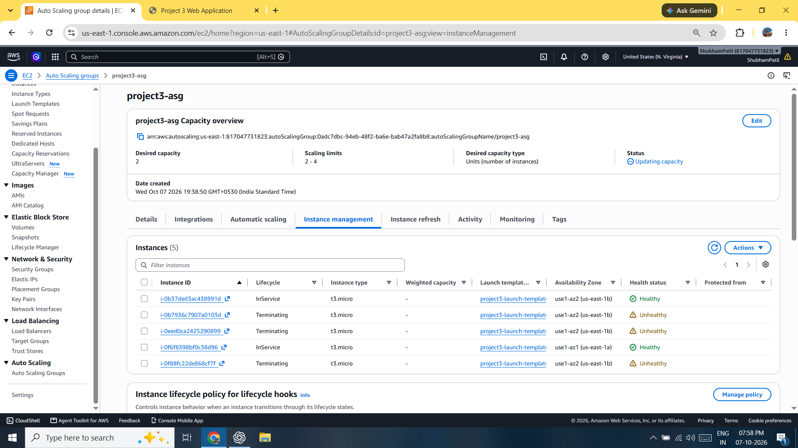

---

## 5. Final Target Health

After the replacement instance passed the health check:

```text
Registered Targets: 2
Healthy: 2
Unhealthy: 0
```

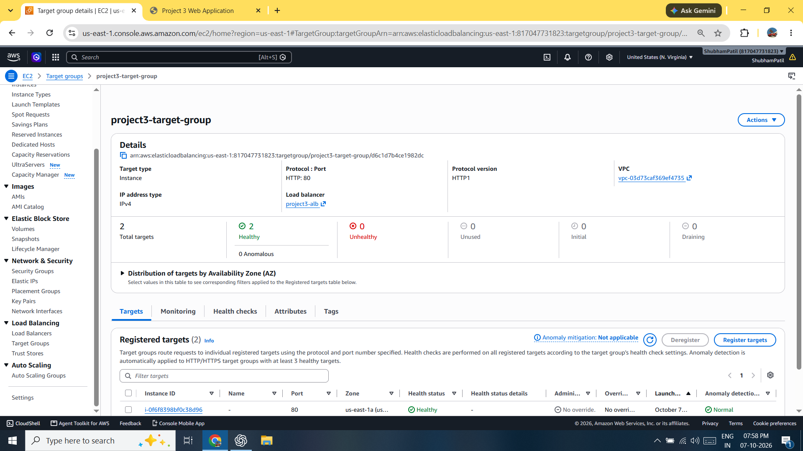

---

## 6. Application Availability After Failure

The application remained accessible through the same ALB DNS name after the original EC2 instance was terminated.

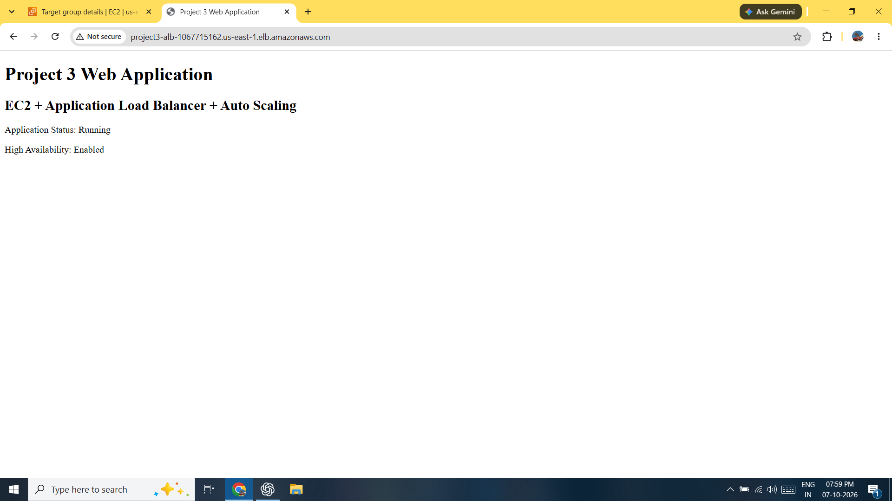

This demonstrates that the application remained available despite the failure of an individual EC2 instance.

---

# 📸 Screenshots

## 1. Launch Template

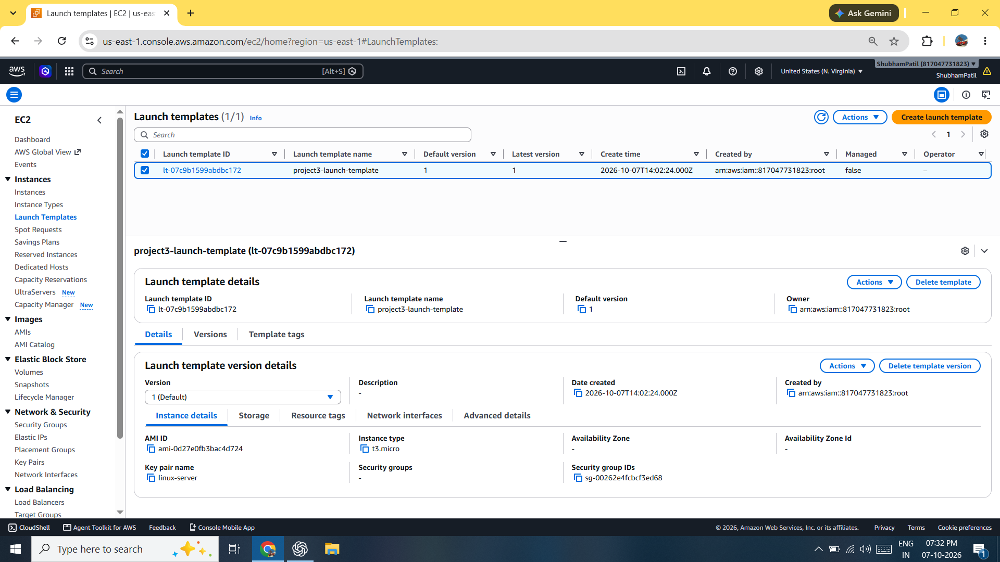

## 2. Target Group

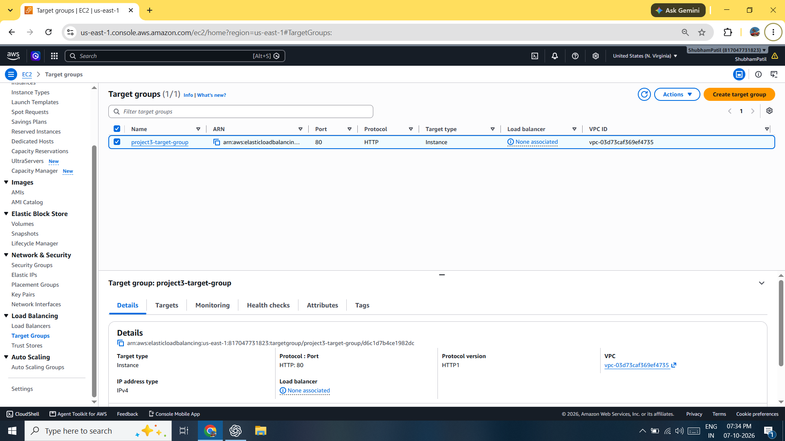

## 3. Application Load Balancer

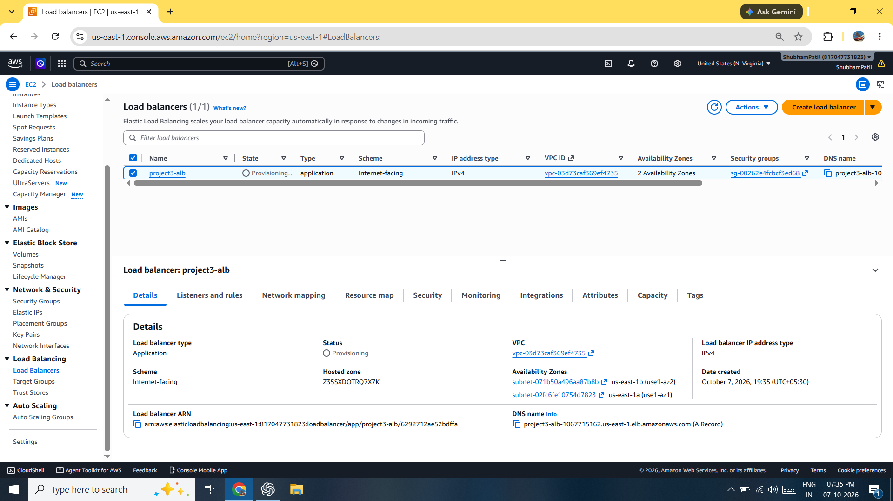

## 4. Auto Scaling Group

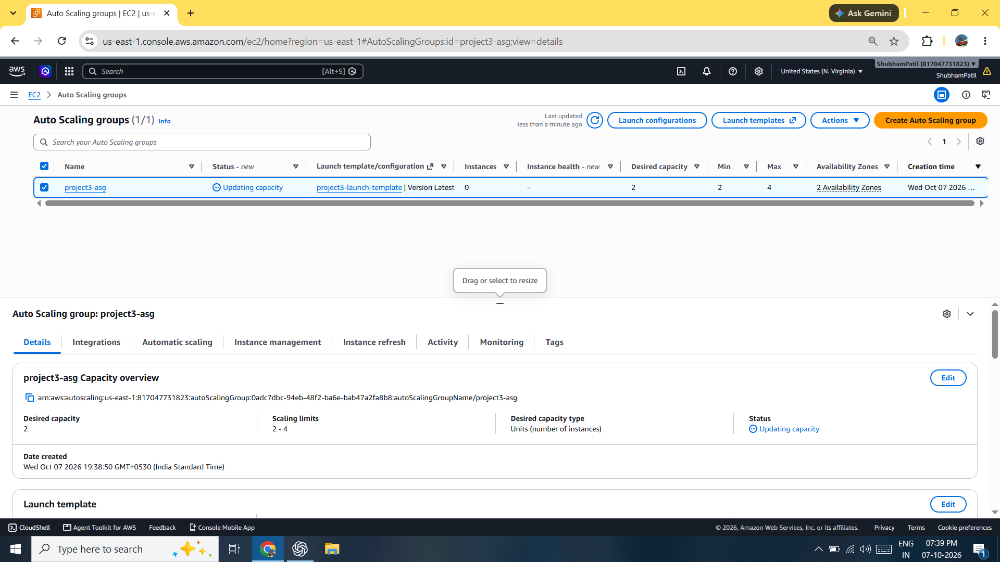

## 5. Auto Scaling Instances

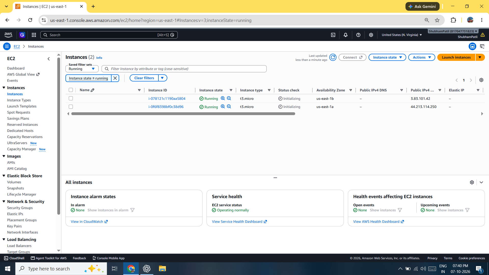

## 6. Healthy Targets


## 7. ALB Web Application


## 8. Instance Failure


## 9. Replacement Instance


## 10. Final Healthy Targets


## 11. ALB After Failure


---
